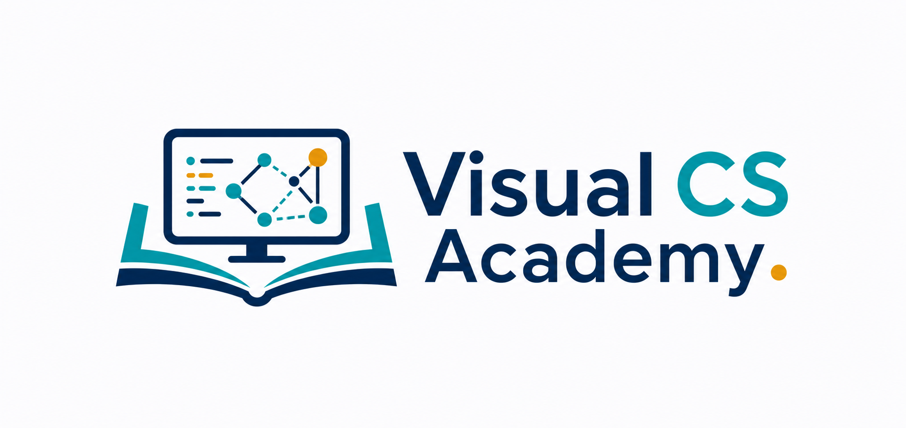

# Visual CS Academy



Visual CS Academy is a visual-first, self-contained Computer Science study platform built for students preparing for exams.

The current milestone is a polished Data Structures study guide delivered as a single `index.html` app with no backend and fast GitHub Pages hosting.

## Live Site

https://asinay.github.io/visual-cs-academy/

## Repository

https://github.com/asinay/visual-cs-academy

## Branding

- App logo: `assets/logo.png`
- Brand mark: `assets/logo-mark.png`
- Favicon: `assets/favicon.ico`
- App screenshot: `assets/screenshots/home.png`

## Current Focus

- Trees
- Sorting

## Backlog

- Add 100+ questions
- Add Dark Mode
- Improve mobile UX
- Add search
- Add cheat sheets

## Done

- Progress tracking
- Basic quizzes
- GitHub Pages
- Visual references

## Project Structure

```text
visual-cs-academy/
├── index.html
├── README.md
├── LICENSE
├── AGENTS.md
├── .gitignore
└── assets/
    ├── favicon.ico
    ├── logo.png
    └── screenshots/
        └── home.png
```

## Local Development

Open `index.html` directly in a browser. No build step or backend is required.

## Principles

- Visual learners first
- Mobile friendly
- Self-contained HTML
- No backend
- Fast loading
- Professional appearance
- Clear over clever
